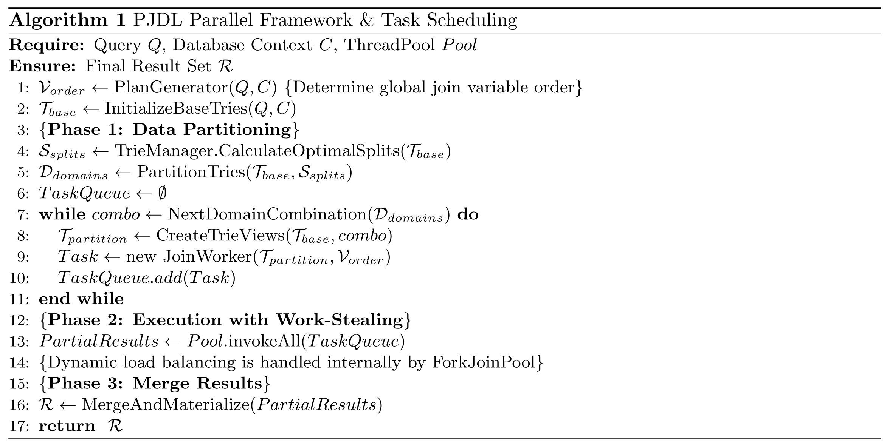
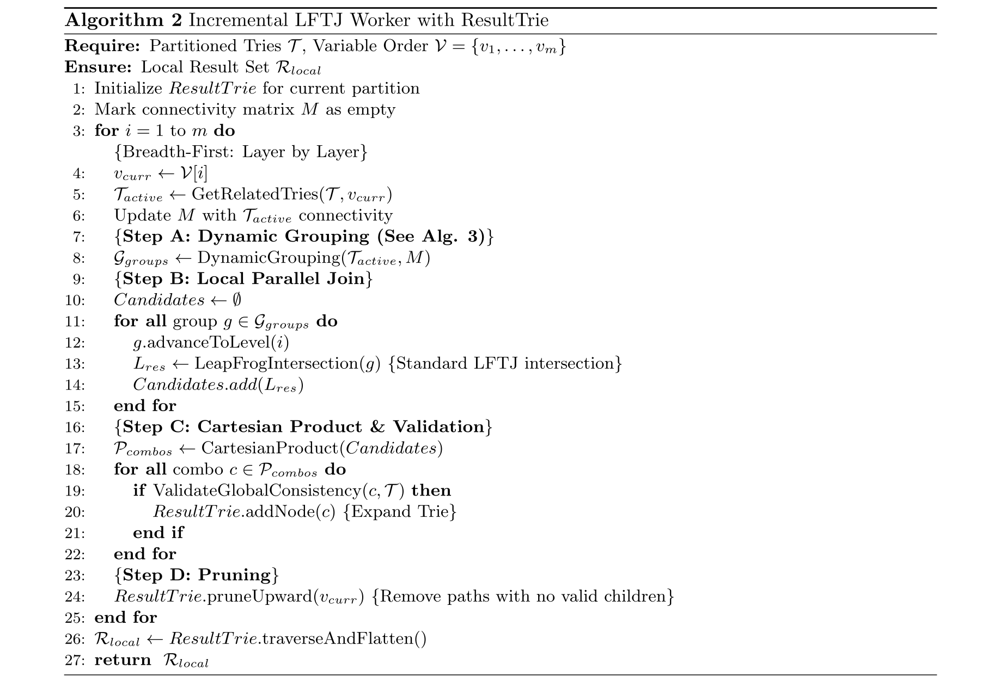
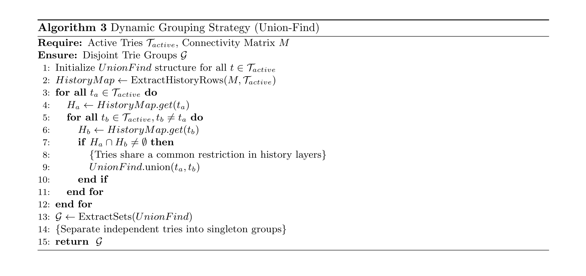

# Core Algorithm & System Description

PJDL adopts a **"Two-Level Parallelism"** strategy, combining coarse-grained data partitioning with fine-grained task scheduling, to transform the traditional depth-first Leapfrog Triejoin (LFTJ) into a **breadth-first incremental construction process**. The core workflow is as follows:

#### 1. Parallelism & Load Balancing

- **Foundation Parallelism:** The system first utilizes **Data Partitioning** techniques to decompose the massive search space into multiple independent subspace combinations, thereby establishing the baseline concurrency capability.
- **Dynamic Scheduling:** Tasks generated from partition combinations are scheduled using the **Work-Stealing** mechanism of the Java `ForkJoinPool`. This ensures effective dynamic load balancing in multi-core environments prone to **Data Skew**, as idle threads automatically offload work from busy threads.

#### 2. Incremental Execution Flow

The system initializes a **ResultTrie** structure for the $n$ partitions involved in the join. The ResultTrie resembles a standard Trie but is specialized for layer-wise growth, recording only the valid intermediate results of each join layer. The specific execution steps are as follows:

- **Dynamic Grouping:** When processing each variable layer, the system retrieves all relevant ResultTries. Based on **Historical Connectivity**, logically connected Tries are clustered into disjoint groups, while those not involved in the current join are grouped independently.
- **Parallel Local Join:** The LFTJ algorithm is executed in parallel within each group to identify candidate valid nodes for the current variable.
- **Task Generation & Validation:** Based on the candidate nodes generated by each group, candidate **Cartesian Product** combinations are constructed. The system validates the global consistency of all combinations in parallel to filter out the final valid nodes.
- **Pruning & Expansion:** Based on the validation results, all ResultTries undergo parallel pruning (removing invalid paths) and layer-wise expansion.
- **Merge:** Once all variables are processed, the ResultTrie stores the complete join paths. Finally, the system merges the partial results from all parallel tasks to output the final result set.

**The pseudo-code is presented below:**

